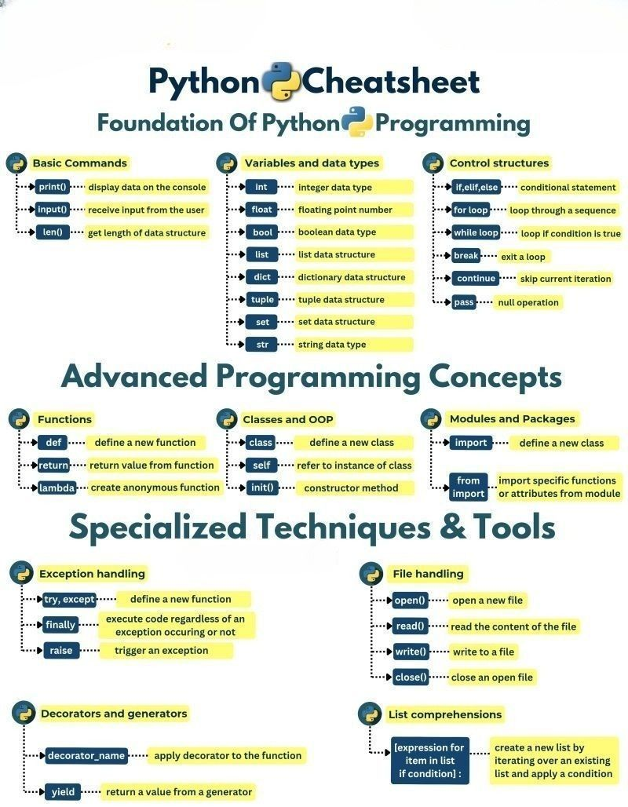

## 📝 𝗣𝘆𝘁𝗵𝗼𝗻 𝗖𝗵𝗲𝗮𝘁𝘀𝗵𝗲𝗲𝘁: 𝗔 𝗖𝗼𝗺𝗽𝗿𝗲𝗵𝗲𝗻𝘀𝗶𝘃𝗲 𝗚𝘂𝗶𝗱𝗲 𝗳𝗼𝗿 𝗗𝗲𝘃𝗲𝗹𝗼𝗽𝗲𝗿𝘀

### 🐍 𝐏𝐲𝐭𝐡𝐨𝐧 𝐜𝐡𝐞𝐚𝐭𝐬𝐡𝐞𝐞𝐭 𝐭𝐡𝐚𝐭 𝐜𝐨𝐯𝐞𝐫𝐬:

#### 🔹 𝐁𝐚𝐬𝐢𝐜 𝐂𝐨𝐦𝐦𝐚𝐧𝐝𝐬:
- `print()`: Display output
- `input()`: Get user input
- `len()`: Find the length of a structure

#### 🔹 𝐕𝐚𝐫𝐢𝐚𝐛𝐥𝐞𝐬 𝐚𝐧𝐝 𝐃𝐚𝐭𝐚 𝐓𝐲𝐩𝐞𝐬:
- Types like `int`, `float`, `bool`, `list`, `dict`, and more
- Essential for managing and manipulating data effectively

#### 🔹 𝐂𝐨𝐧𝐭𝐫𝐨𝐥 𝐒𝐭𝐫𝐮𝐜𝐭𝐮𝐫𝐞𝐬:
- Use `if`, `for`, and `while` loops to control the flow of your programs
- Manage iterations and conditions with `break`, `continue`, and `pass`

#### 🔹 𝐀𝐝𝐯𝐚𝐧𝐜𝐞𝐝 𝐏𝐫𝐨𝐠𝐫𝐚𝐦𝐦𝐢𝐧𝐠 𝐂𝐨𝐧𝐜𝐞𝐩𝐭𝐬:
- Functions: Create reusable blocks of code using `def`, `return`, and `lambda`
- Object-Oriented Programming (OOP): Define classes with `class`, `self`, and `init()`
- Modules and Packages: Use `import` and `from` to bring in external functionality

#### 🔹 𝐒𝐩𝐞𝐜𝐢𝐚𝐥𝐢𝐳𝐞𝐝 𝐓𝐞𝐜𝐡𝐧𝐢𝐪𝐮𝐞𝐬 & 𝐓𝐨𝐨𝐥𝐬:
- Exception Handling: Handle errors gracefully with `try`, `except`, `finally`, and `raise`
- File Handling: `open`, `read`, `write`, and `close` files seamlessly
- Decorators and Generators: Streamline function behavior with `decorators` and `yield` values with `generators`
- List Comprehensions: Create concise `lists` with powerful expressions

Having these essentials at your fingertips will not only boost your productivity but also improve your understanding of Python’s core concepts.